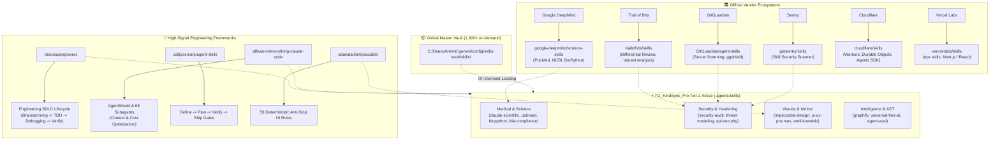

# Skill Intelligence Source Graph & Provenance Architecture

```mermaid
flowchart TD
    subgraph Official_Vendors ["🏛️ Official Vendor Ecosystems"]
        V1["Google DeepMind"] --> S1["google-deepmind/science-skills\n(PubMed, NCBI, BioPython)"]
        V2["Trail of Bits"] --> S2["trailofbits/skills\n(Differential Review, Variant Analysis)"]
        V3["GitGuardian"] --> S3["GitGuardian/agent-skills\n(Secret Scanning, ggshield)"]
        V4["Sentry"] --> S4["getsentry/skills\n(Skill Security Scanner)"]
        V5["Cloudflare"] --> S5["cloudflare/skills\n(Workers, Durable Objects, Agents SDK)"]
        V6["Vercel Labs"] --> S6["vercel-labs/skills\n(npx skills, Next.js / React)"]
    end

    subgraph Community_Powerhouses ["🚀 High-Signal Engineering Frameworks"]
        C1["obra/superpowers"] --> P1["Engineering SDLC Lifecycle\n(Brainstorming -> TDD -> Debugging -> Verify)"]
        C2["affaan-m/everything-claude-code"] --> P2["AgentShield & 68 Subagents\n(Context & Cost Optimization)"]
        C3["addyosmani/agent-skills"] --> P3["Define -> Plan -> Verify -> Ship Gates"]
        C4["adawdani/impeccable"] --> P4["59 Deterministic Anti-Slop UI Rules"]
    end

    subgraph Local_Workspace_Tier1 ["⚡ TG_KindSync_Pro Tier-1 Active (.agents/skills)"]
        T1["Medical & Science\n(claude-scientific, pubmed, biopython, fda-compliance)"]
        T2["Security & Hardening\n(security-audit, threat-modeling, api-security)"]
        T3["Visuals & Motion\n(impeccable-design, ui-ux-pro-max, emil-kowalski)"]
        T4["Intelligence & AST\n(graphify, universal-free-ai, agent-eval)"]
    end

    subgraph Vault_Tier2 ["📦 Global Master Vault (1,600+ on-demand)"]
        G1["C:/Users/Ammit/.gemini/config/skills-vault/skills/"]
    end

    S1 -.-> T1
    S2 -.-> T2
    S3 -.-> T2
    S4 -.-> T2
    C1 -.-> Local_Workspace_Tier1
    C2 -.-> Local_Workspace_Tier1
    C4 -.-> T3
    G1 -.->|On-Demand Loading| Local_Workspace_Tier1
```
